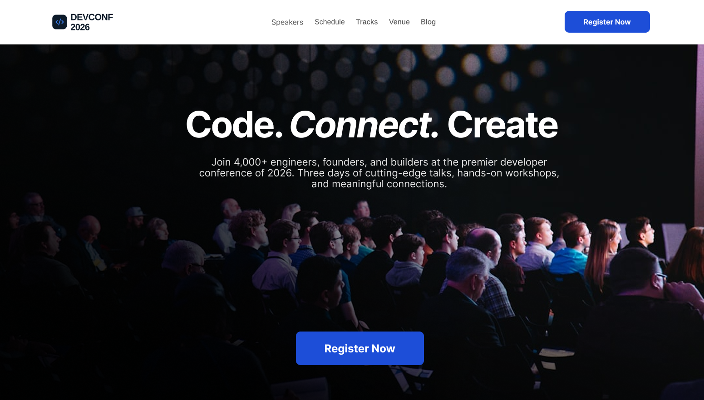

# 🚀 DevConf 2026

A modern, responsive developer conference landing page built with HTML5 and CSS3, featuring a clean UI, glassmorphism effects, and responsive layouts.

## 📸 Preview




## 🌐 Live Demo

🔗 https://moinul-islam-71.github.io/A01-DevConf-2026/

## 📂 GitHub Repository

🔗 https://github.com/Moinul-Islam-71/A01-DevConf-2026.git

---

## ✨ Features

- Navigation Bar
- Modern Hero Section
- Speakers Section
- Pricing Cards
- AI-generated Responsive Testimonials Section
- Footer
- Clean UI Design
- Glassmorphism Effects with the help of AI
- Smooth Hover Animations

---

## 🛠️ Technologies Used

- HTML5
- CSS3
- Google Fonts
- Flexbox
- CSS Grid

---


---

## 📁 Folder Structure

```
project/
│
├── assets/
├── ui/
├── DevConf2026.fig
├── index.html
├── PROMPTS.md
├── style.css
└── README.md
```

---

## 🤖 AI Prompt

This project includes an AI-generated Testimonials section.

Prompt used:

> Act as a senior front-end developer with 20 years of experience...
> I am providing you my web page with HTML and external CSS file. Create a modern, responsive Testimonials section for a developer conference landing page corresponding to the provided html and css webpage. The website already contains a Hero section, Speakers section, and Pricing section. Design a testimonials section that naturally fits below the pricing cards. Use glassmorphism cards, rounded corners, subtle hover animations, and clean typography. Include three testimonial cards with circular avatars, five-star ratings, attendee names, job titles, and realistic feedback. The layout should be fully responsive using HTML and external CSS only. Ensure the design matches the premium aesthetic of a modern tech conference website.

---

## 📚 What I Learned

- Semantic HTML (`<nav>`, `<main>`, `<footer>`, `<header>`, ...)
- Inline Elements (`<span>`, `<a>`, `<em>`, ``, ...)
- Block Elements (`<div>`, `<p>`, `<h1>`..`<h6>`, `<section>`, `<ul>`, `<ol>`, `<li>`, ...)
- Self-closing tags (also called void elements) (``, `<br>`, `<meta>`, ...)
- Non-Self-Closing Tags (Container Elements) (`<div>`, `<span>`, `<p>`, `<a>`, `<button>`, `<h1>`, ..`<h6>`, ...)
- CSS Flexbox
- CSS Grid
- Responsive Design
- Glassmorphism UI
- Git & GitHub Workflow

> AI was used only for the Testimonials section, following the assignment requirements.

---

## 👨‍💻 Author

S M Moinul Islam

GitHub:
https://github.com/Moinul-Islam-71/
